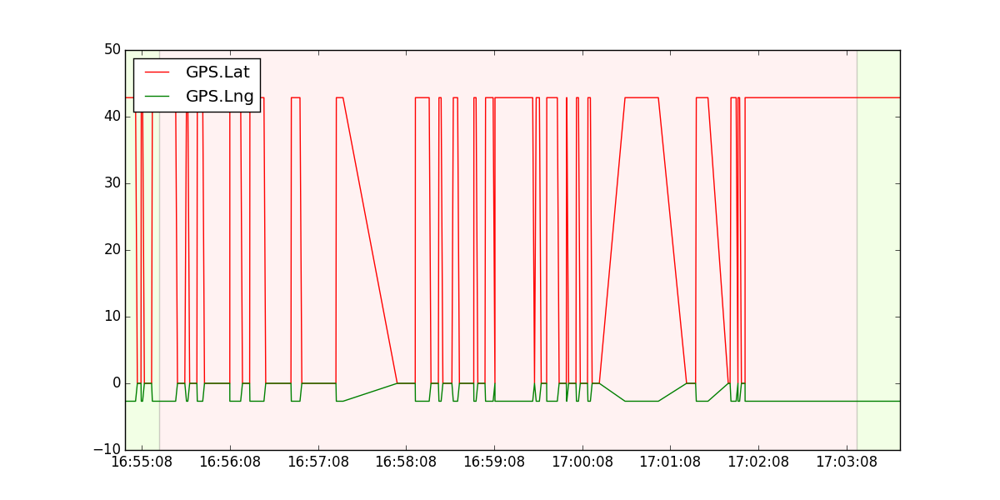
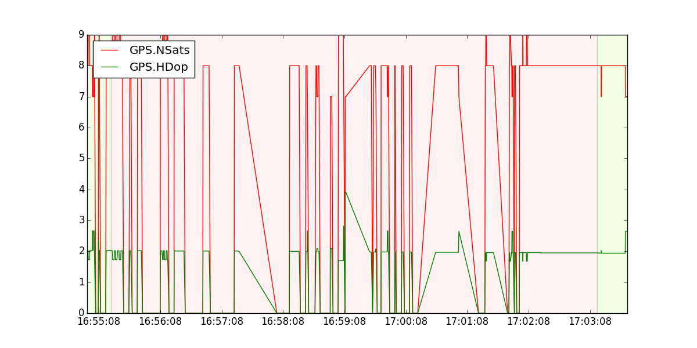

# GPS

When in autopilot modes (Loiter, RTL, AUTO) position errors from the GPS can cause APM:Copter to think that it’s suddenly in the wrong position and lead to aggressive flying to correct the perceived error.  These “glitches” show up in both the tlogs and dataflash logs as an decrease in the number of satellites visible and an increase in the hdop.

```bash
mavgraph.py 30.BIN "GPS.Lat" "GPS.Lng" --flightmode=apm
```




If using tlogs graph the you can do this by graphing the GPS_RAW_IT group’s “eph” and “satellites_visible” values.  An hdop value of 1.5 (displayed as 150) or lower is very good.  Over 2.0 (i.e. 200) indicates a bad position value.  The number of satellites falling below 9 is also bad.  A significant change in these two values often accompanies a GPS position change. In the Dataflash logs’s GPS message you will find the “HDop” and “NSats”.


