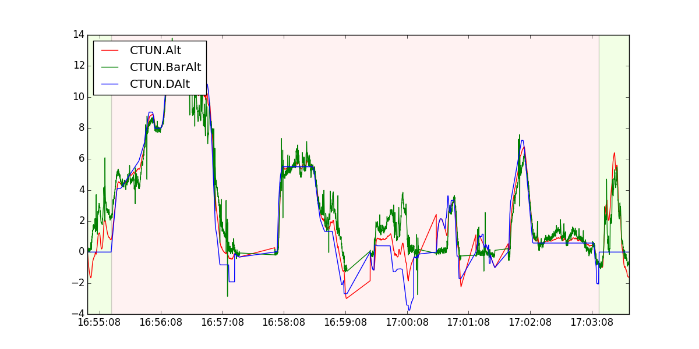

# Mantenimiento de altitud

En el **modo de mantenimiento de altitud**, el helicóptero mantiene una altura constante al tiempo que permite controlar normalmente el *roll*, *pitch* y *yaw*. Esta página contiene información importante sobre el uso y puesta a punto del **modo ALT_HOLD**.

Cuando el **modo de mantenimiento de altitud** (aka **ALT_HOLD**) es selecionado el acelerador se controla automáticamente para mantener la altitud actual. *roll*, *pitch* and *yaw* funcionan de la misma manera que en el modo `stabilize` lo que significa que el piloto controla directamente las condiciones de *roll* y los ángulos de *pitch* y el *yaw*.

El modo mantenimiento automática de altitud es una característica de muchos otros modos de vuelo (*Loiter*, *Sport*, etc) por lo que la información que aquí se refiere a esos modos también.

** Nota **: El controlador de vuelo utiliza un barómetro que mide la presión del aire como el medio principal para la determinación de la altitud ("Presión de altitud") y si la presión del aire está cambiando en su área de vuelo debido a condiciones climáticas extremas, el helicóptero seguirá el cambio de presión de aire en lugar de la altitud real (a menos que esté a menos de 20 pies del suelo y este instalado y habilitado un SONAR ). Por debajo de 26 pies, el SONAR (si está habilitado) proporcionará automáticamente el mantenimiento de altitud aún más preciso.

##Controls
El piloto puede controlar la velocidad de ascenso o descenso del vehículo con el mando del acelerador.

+ Si el acelerador está en el medio (40% ~ 60%) el vehículo mantendrá la altitud actual.

#Verificación del rendimiento *ALT_Hold* con logs

La mejor forma de ver el rendimiento del modo mantenimiento de altitud es revisar los datos de vuelo. y luego abrirlo con **mavgraph** y representar la altura del barómetro, la altitud deseada y estimación de la altitud en base navegación inercial. Estos doatos se encuentran de maneras distinta en los diferentes versiones de APM.

En las versiones AC3.2 se pueden encontrar los datos: CTUN’s BarAlt (altitud del barómetro), DAlt (Altitud deseada) y Alt (Altura estimada inercialmente)

Los tres se deben representar como se muestra a continuación.

