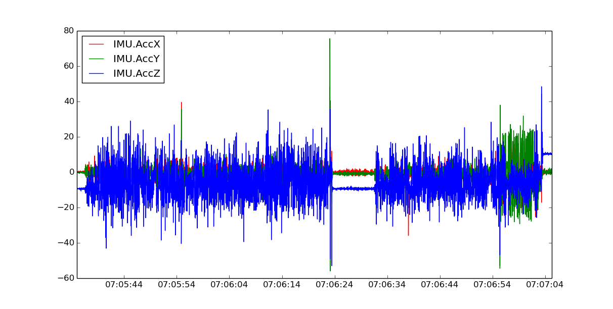
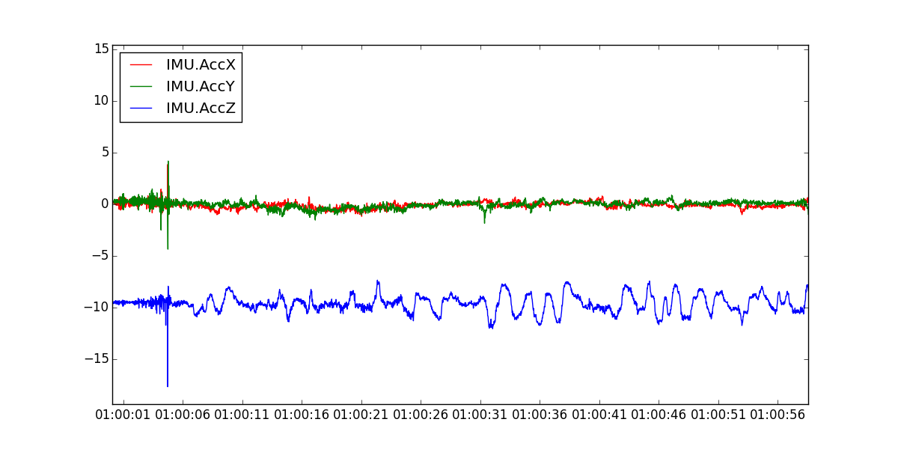

# IMU

Las altas vibraciones pueden causar que la estimación basada en los acelerómetros de la posición de altitud y posición tengan una deriva. Esto genera probleas en el modo de bloqueo de altitud lanzando hacia el cielo el vehículo y en el modo Loiter no posicionar correctamente y estar a la deriva.

Las vibraciones se pueden ver mejor representandolas en una gráfica gracias a los logs. Los valores a representar son: AccX, AccY y AccZ. Los valores de **AccX y AccY tiene que estar entre -3 y +3 m/s/s** y el **AccZ tiene que estar entre -15 y -5 m/s/s**

Vibrations are best viewed by graphing the dataflash’s IMU message’s AccX, AccY and AccZ values. **The AccX and AccY values should be between -3 and +3 m/s/s** and the **AccZ should be between -15 and -5 m/s/s**. Los valores del acelerómetro cambiarán momentaneamente cuando el vehículo se mueva hacia arriba o hacia abajo por lo que es mejor ver estos datos cuando el vehículo esta sobre el suelo.

La gráfica a continuación muestra un alto nivel de vibraciones. Los valores AccX, AccY y AccZ tienen altas variaciones. Este no es un buen resultado.

La gráfica siguiente muestra una vibración aceptable. Los valores AccX y AccY están entre -3 y +3 m/s/s y AccZ esta entre -15 and -5 m/s/s.

