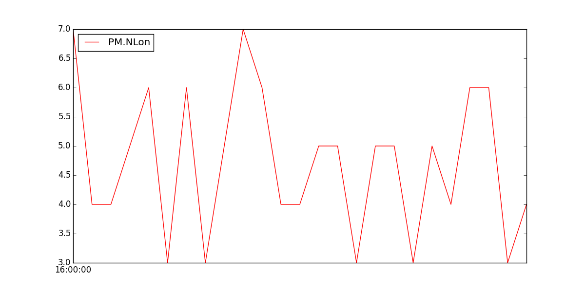

# Monitorización del redimiento 
La monitorización del rendimiento o PM esta presente en los datos de vuelo:
```
PM {NLon : 6, NLoop : 1000, MaxT : 23731, PMT : 9, I2CErr : 0, INSErr : 0, INAVErr : 0}
```
Estos datos pueden ser interpretados como:

+ **NLon**: Número de bluces que han tardado más del tiempo estipulado en ejecutar. ( es decir, aquellos procesos que toman más de 5% de tiempo estipulada para ejecutar).
+ **NLoop**: El número total de bucles desde la última vez que se mostró el mensaje PM. Normalmente es 1000 y permite calcular el porcentaje de bucles que se ejecutan lentamente, nunca debe superar el 15%.
+ **MaxT**: El tiempo máximo que algún bucle tomó desde el último mensaje PM. Esto debería estar cerca de 10.000 pero será hasta 6.000.000 mientras se arman los motores.
+ **PMT**: Este número aumenta cada vez que se recibe un bit de vida desde la estación base. 
+ **I2CErr, INAVErr, INSErr**: el número de errores I2C, INAV e INS desde el último mensaje PM. Algunos errores I2C pueden indicar problemas en el bus I2C. 

El número de bucles lentos se muestran:
```
mavgraph.py 5.BIN "PM.NLon"
```



